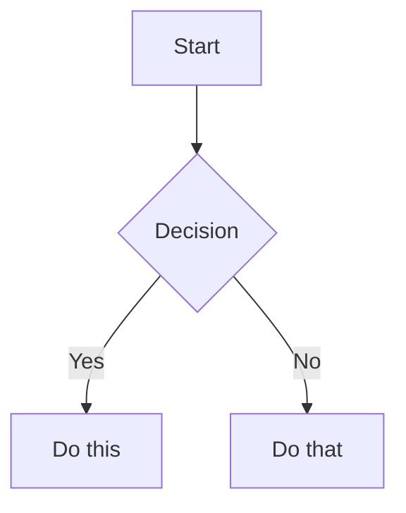

# 📝 Markdown Language - Complete Notes

A quick reference for all essential **Markdown** features — ideal for writing `README.md` or other documentation.

---

## 🧱 Basic Structure

### 1. Headings
Use `#` to `######` for heading levels 1–6:
```markdown
# H1
## H2
### H3
#### H4
##### H5
###### H6
```

---

### 2. Text Formatting
```markdown
**Bold**        =>  **Bold**
*Italic*        =>  *Italic*
***BoldItalic*** => ***BoldItalic***
~~Strikethrough~~ => ~~Strikethrough~~
```

---

### 3. Blockquotes
```markdown
> This is a quote
>> Nested quote
```

---

### 4. Lists

#### • Unordered List
```markdown
- Item 1
* Item 2
+ Item 3
```

#### • Ordered List
```markdown
1. First
2. Second
3. Third
```

#### • Nested List
```markdown
- Main Item
  - Sub Item
    - Sub-sub Item
```

---

### 5. Links and Images

#### • Link
```markdown
[Google](https://www.google.com)
```

#### • Image
```markdown

```

#### • Image with Title Tooltip
```markdown

```

---

### 6. Code

#### • Inline Code
```markdown
Use `printf()` to print.
```

#### • Code Block (Fenced)
<pre>
```cpp
#include <iostream>
int main() {
    std::cout << "Hello, World!";
}
```
</pre>

---

### 7. Horizontal Line
```markdown
---
***
___
```

---

### 8. Tables
```markdown
| Name   | Age | City     |
|--------|-----|----------|
| Alice  | 25  | New York |
| Bob    | 30  | London   |
```

---

### 9. Task Lists (GitHub Flavored)
```markdown
- [x] Completed task
- [ ] Incomplete task
```

---

## 🔁 Advanced Markdown

### 10. Table of Contents
```markdown
[TOC]
```

### 11. HTML in Markdown
```html
<div align="center">
  <b>Bold Centered Text</b>
</div>
```

### 12. Escaping Characters
```markdown
\*not italic\*
```

### 13. Footnotes
```markdown
This is a sentence with a footnote.[^1]

[^1]: This is the footnote.
```

### 14. Automatic Links
```markdown
<https://www.google.com>
```

### 15. Diagrams (Mermaid)
<pre>

</pre>

### 16. LaTeX / Math (Markdown Preview Enhanced)
```markdown
$$
E = mc^2
$$
```

---

## ✅ Best Practices for README.md

| Tip                | Description                        |
|--------------------|------------------------------------|
| Use `# Title`      | Start with a clear project title   |
| Add badges         | Use [shields.io](https://shields.io) |
| Use lists & tables | For clarity and organization       |
| Add screenshots    | Help readers visualize             |
| License section    | At the bottom                      |
| Contribution guide | How others can contribute          |

---

_Use this file as a reference for all common Markdown syntax._
